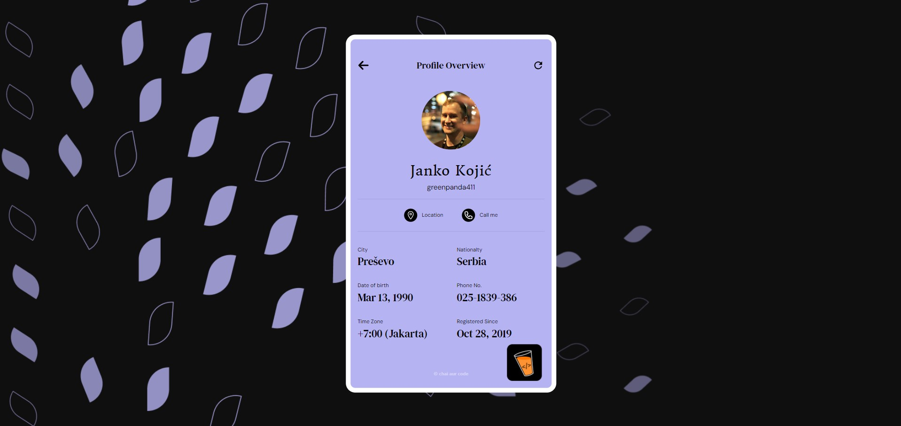
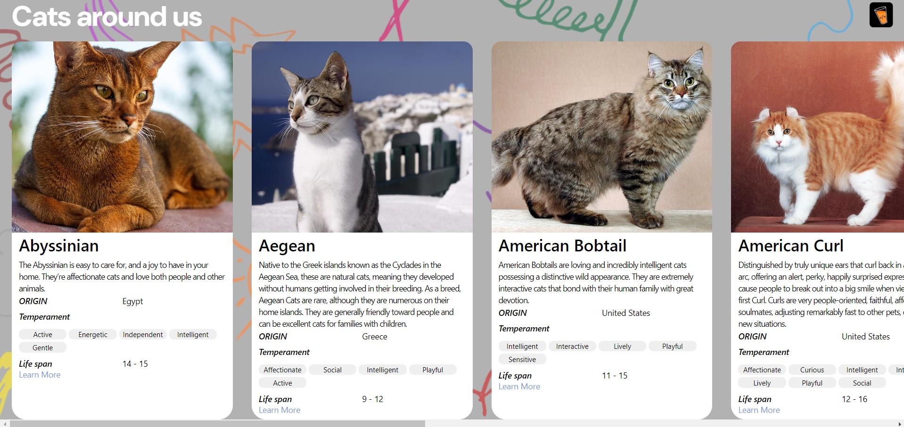

# Chai Aur Code Assignment

## This is the machine coding assignment-2 on (React JS)

1. Random User Profile

 

2. Random Jokes Tweet

3. Cat-listing

This is my submission for machine coding round-2 hosted by chaicode. Thank you for awesome react questions, it was fun building it.

Link to Hosted Site : https://chaicode-reactjs-assignment-round2.netlify.app/
